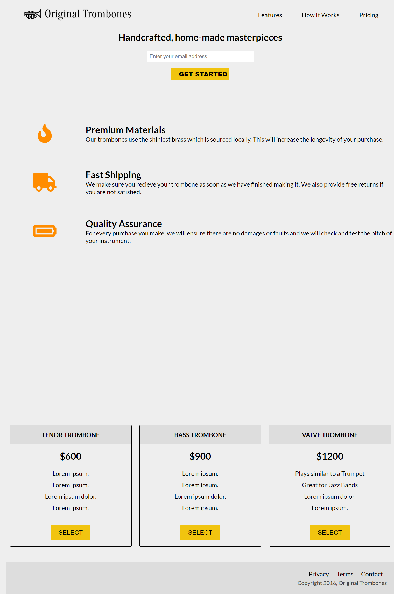

# A PRODUCT LANDING PAGE

> A product landing page built for marketing.



## Built With

- HTML5 elements
  - `footer`, `section`, `div`, etc.
- CSS properties

  - CSS Background for page aesthetic using
    `background-color`, `background`, .
  - CSS Typography properties
    `text-decoration`, `text-transform`, `color`, etc
  - CSS Box Model properties
    `border-bottom`, `padding`, `box-sizing`, etc
  - CSS Flexbox properties
    `flex-direction`, `align-items`, `flex-wrap`, `` etc
  - CSS Cursor properties `cursor`

- Linters
  - [Prettier](https://prettier.io/),
  - [Stylelint](https://stylelint.io/).
- GitHub Action

## Live Demo

[Live Demo Link](https://fcc-product-landing-page-ismail.netlify.app/)

### Development (Running locally)

- Clone the project

```bash
git clone git@github.com:ismailadekunle/17-fcc-product-landing-page.git

```

- Install Dependencies

```bash
yarn install
```

To run StyleLint by itself, you may run the lint task:

```bash
yarn lint:check
```

Or to automatically fix issues found (where possible):

```bash
yarn lint
```

You can also check against Prettier:

```bash
yarn format:check
```

and to have it fix (to the best of its ability) any format issues, run:

```bash
yarn format
```

You can also check against Webhint:

```bash
yarn hint
```

## Style Guides

- [CSS Style Guide](http://udacity.github.io/frontend-nanodegree-styleguide/css.html)
- [HTML Style Guide](http://udacity.github.io/frontend-nanodegree-styleguide/index.html)
- [JavaScript Style Guide](http://udacity.github.io/frontend-nanodegree-styleguide/javascript.html)
- [Git Style Guide](https://udacity.github.io/git-styleguide/)

## 👤 Author

- Github: [@author](https://github.com/author)
- Twitter: [@author](https://twitter.com/author)
- Linkedin: [@author](https://www.linkedin.com/in/author/)

## 🤝 Contributing

Contributions, issues and feature requests are welcome!

Feel free to check the [issues page](../../issues).

## Show your support

Give a ⭐️ if you like this project!

## Acknowledgments

- Hat tip to anyone whose code was used
- Inspiration, resources/assets used
- etc

## 📝 License

[MIT licensed](./LICENSE).
